# KH1 Crowd Control

Lets Twitch [Crowd Control](https://crowdcontrol.live/) redemptions trigger real effects in Kingdom Hearts Final Mix (PC) - spawn items and Heartless near Sora, pop messages on screen, grant abilities, hinder combos, or KO him outright.

The mod is a thin connector: it opens a TCP connection to the Crowd Control app and dispatches the effects it receives into [KH1-LUA-LIBRARY](../KH1-LUA-LIBRARY), which does the actual game-memory work. It does not run standalone.

## Installing
- Install Kingdom Hearts Final Mix (PC, Steam or EGS).
- Open KH1 at least once.
- Download and extract the latest version of [OpenKH](https://github.com/OpenKH/OpenKh/releases/latest).
- Open `OpenKh.Tools.ModsManager.exe`.
- You'll be presented with the set up wizard when opening the mods manager for the first time.  In the wizard, do the following:
  - Set up your game edition/installation folders (again, only Steam and EGS are currently supported).

  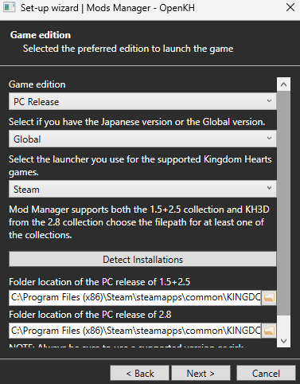

  - When prompted, install Panacea.

  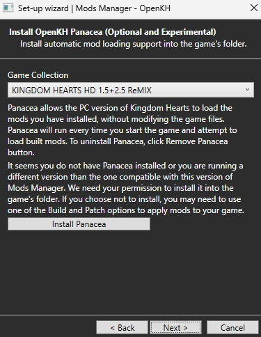

  - When prompted, install Lua Backend for at least KH1.

  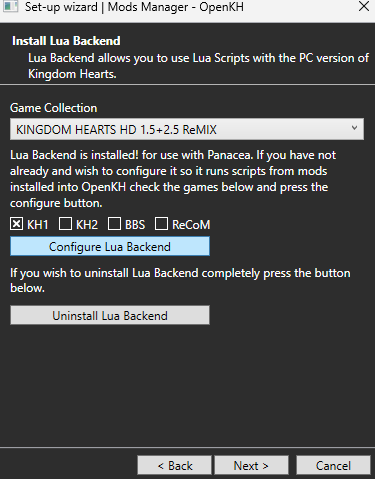

  - You may chooose to create `steam_appid.txt`.

  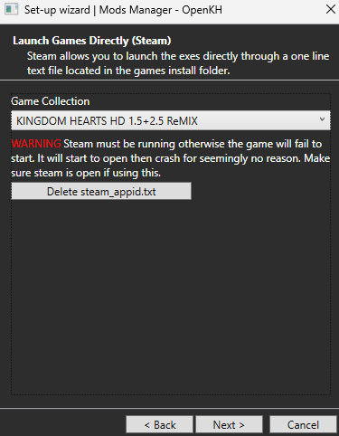

  - Extracting data is not required for CrowdControl.

  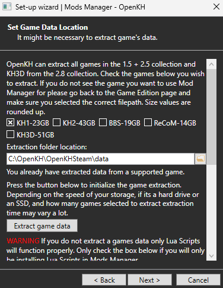

- Ensure that you have selected "Kingdom Hearts 1" in the dropdown on the top right.

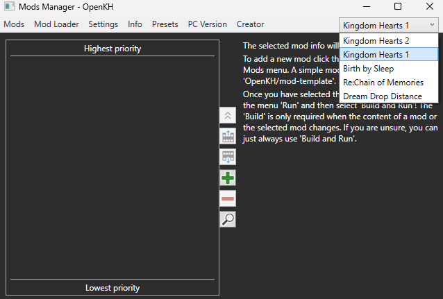

- Click the green "+" to install a new mod.

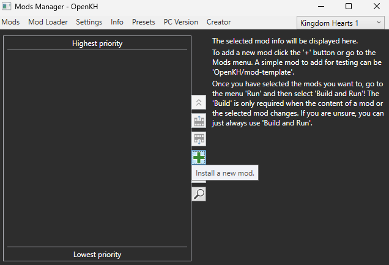

- In the "Add a new mod from GitHub" form, enter `gaithern/KH1-LUA-LIBRARY` and click "Install".

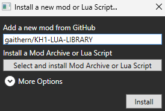

- You'll see the mod added to your mod list.

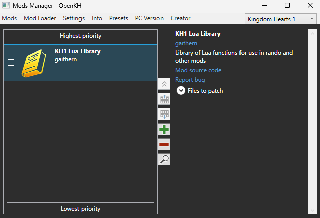

- Click the green "+" again to install another new mod.

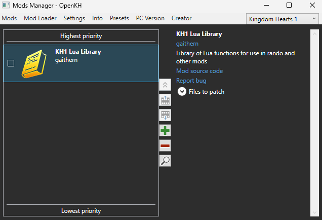

- In the "Add a new mod from GitHub" form, enter `gaithern/KH1-CROWDCONTROL` and click "Install".

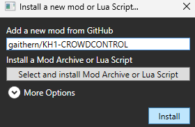

- You'll see the second mod added to your mod list.

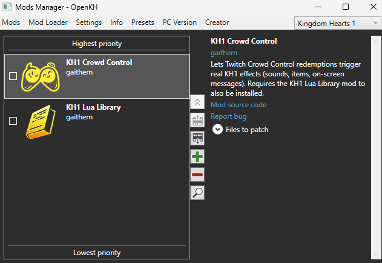

- Click the checkbox next to both mods.

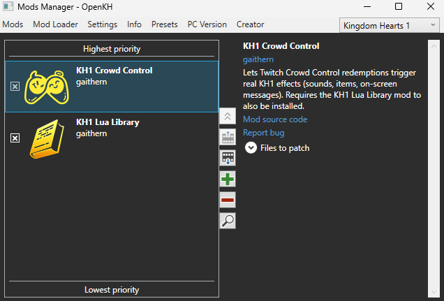

- Click "Mod Loader" at the top, and then "Build and Run."  The game will open with your new mods installed.

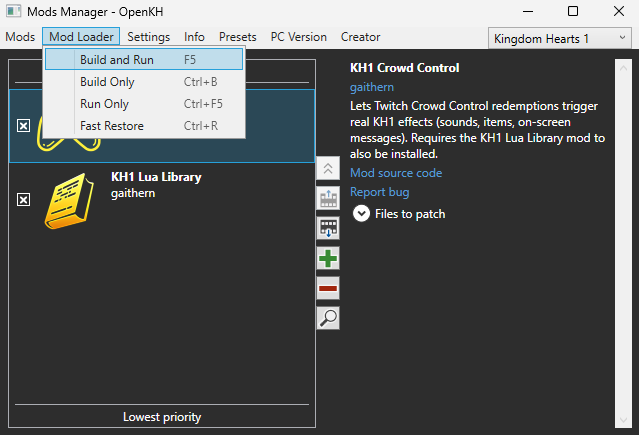

- The game should now automatically communicate with the CrowdControl desktop app.

## Repository Layout
Below you'll find key components of the repository and their descriptions.

- `native/KH1CrowdControlNative/*`

  | File | Description |
  | :--- | ----------: |
  | `log.cpp` | Handles writing to a shared log for debugging purposes. |
  | `lua_api.cpp` | Identifies the Lua module and populate Lua C function pointers. |
  | `lua_bindings.cpp` | Exposes C++ to be used on the Lua side. |
  | `message_parser.cpp` | Slim JSON handling for received packets from CrowdControl server. |
  | `winsock.cpp` | Initializes/cleans up Windows Socket API for connection to CrowdControl server. |

- `pack/*`

  | File | Description |
  | :--- | ----------: |
  | `kh1-crowdcontrol-pack.json` | Catalog of effects in JSON format. |
  | `KH1CrowdControlPack.cs` | Catalog of effects in C# format. |

- `scripts/*`

  | File | Description |
  | :--- | ----------: |
  | `io_packages/kh1_crowdcontrol_native.dll` | Compiled binary of KH1CrowdControlNative above. |
  | `kh1_crowdcontrol.lua` | Driver of effects handling on client side, communicates effects to [KH1-LUA-LIBRARY](https://github.com/gaithern/KH1-LUA-LIBRARY) |

- `build.py`
  - Compiles `kh1_crowdcontrol_native.dll` from its source in `native/KH1CrowdControlNative/*`.
  - Creates relevant `mod.yml` by calling `generate_mod_yml.py`
- `generate_mod_yml.py`
  - Generates `mod.yml` by iterating through `scripts/*`.
- `icon.png`
  - Icon for the mod manager.
- `mod.yml`
  - OpenKH configuration file for what relevant files are here to compile the mod for end users.
- `README.md`
  - This doc.

## Building mod/making changes
If any script or CPP code needs to be changed, those changes should be accurately picked up and compiled by running `python build.py`.